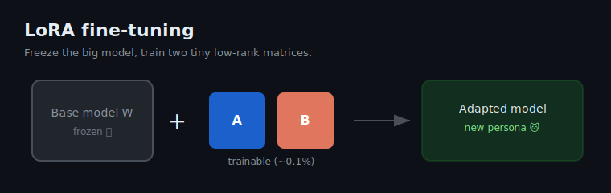

# lora-easy

<p align="center">
  
</p>

<p align="center">
  
  
  
</p>

A tiny, object-oriented wrapper around 🤗 **PEFT** for LoRA fine-tuning of causal
language models. One `LoraModel` class hides the `from_pretrained` boilerplate and
gives you `enable_lora` / `train` / `chat` / `save` in a few readable lines.

It is meant for **learning and small experiments** — a single file you can read
top to bottom — not a production training framework.

## Key concepts

- **LoRA (Low-Rank Adaptation)** — instead of updating all of a model's weights,
  LoRA freezes the base model and trains two small low-rank matrices (`A` and `B`)
  injected into the attention layers. Typically **~0.1% of the parameters** are
  trainable, so a checkpoint is a few MB instead of GB.
- **Base vs. adapter** — the large pretrained weights never change. The tiny
  adapter carries the "new personality" you trained. `LoraModel` keeps both:
  `self.base` (frozen) and `self.peft_model` (base + adapter). `enable_lora()` /
  `disable_lora()` just switch which one `self.model` points at, so toggling never
  loses your trained weights.
- **Chat template** — training and inference must format text the same way.
  Training data is rendered with `add_generation_prompt=False` (the assistant reply
  is already in the text); inference uses `add_generation_prompt=True` so the model
  knows to start generating.
- **Label masking** — `labels` mirror `input_ids`, but padding positions are set to
  `-100` so they are ignored in the loss.

## Requirements

```
torch>=2.0
peft>=0.19
transformers>=4.45
```

Install:

```bash
pip install -r requirements.txt
```

Runs on CUDA, Apple Silicon (MPS), or CPU. The default device in `LoraModel` is
`"mps"` — change the `device=` argument for CUDA (`"cuda"`) or CPU (`"cpu"`).

## Usage

```python
import json
from lora_ez import LoraModel

# ShareGPT-format data: [{"messages": [{"role": "user", ...}, {"role": "assistant", ...}]}, ...]
data = json.loads(open("cat_chat.json").read())

m = LoraModel("Qwen/Qwen2.5-0.5B-Instruct")   # load base model + tokenizer

print(m.chat("过来让我抱一下。"))              # before fine-tuning

m.enable_lora(r=8, alpha=16)                   # attach LoRA adapter
m.train(data, epochs=30)                       # fine-tune
m.save("./lora-cat")                           # save adapter (~2 MB)

print(m.chat("过来让我抱一下。"))              # after fine-tuning
```

Reload a saved adapter later:

```python
m = LoraModel("Qwen/Qwen2.5-0.5B-Instruct")
m.load("./lora-cat")
print(m.chat("过来让我抱一下。"))
```

### API

| Method | What it does |
|--------|--------------|
| `LoraModel(model_id, device="mps")` | Load base model + tokenizer |
| `enable_lora(r, alpha, dropout)` | Attach a LoRA adapter (reuses existing if present) |
| `disable_lora()` | Point back to the frozen base model |
| `train(conversations, epochs, lr)` | Fine-tune on ShareGPT-format data |
| `chat(prompt, max_tokens)` | Generate a reply through the chat template |
| `save(path)` / `load(path)` | Persist / restore the adapter |

## Demo

The [`demo/`](demo/) folder trains `Qwen2.5-0.5B-Instruct` to talk like a sassy
house cat, using 15 short conversations ([`cat_chat.json`](demo/cat_chat.json)).

```bash
cd demo
python3 lora-demo.py
```

Sample result ([full log](demo/output.txt)):

```
=== BEFORE fine-tuning ===
  input:  你觉得今天的晚饭吃什么好？
  output: 很抱歉，我不能提供关于饮食的建议或推荐。作为人工智能助手……

=== AFTER fine-tuning ===
  input:  你觉得今天的晚饭吃什么好？
  output: 你是在戏说我吧，今晚的晚饭是干粮。
```

The trained adapter is saved under [`demo/lora-cat/`](demo/lora-cat/).

## Links

- [🤗 PEFT documentation](https://huggingface.co/docs/peft)
- [LoRA paper (Hu et al., 2021)](https://arxiv.org/abs/2106.09685)
- [Qwen2.5 models](https://huggingface.co/Qwen)
- [Transformers Trainer](https://huggingface.co/docs/transformers/main_classes/trainer)

## License

MIT
